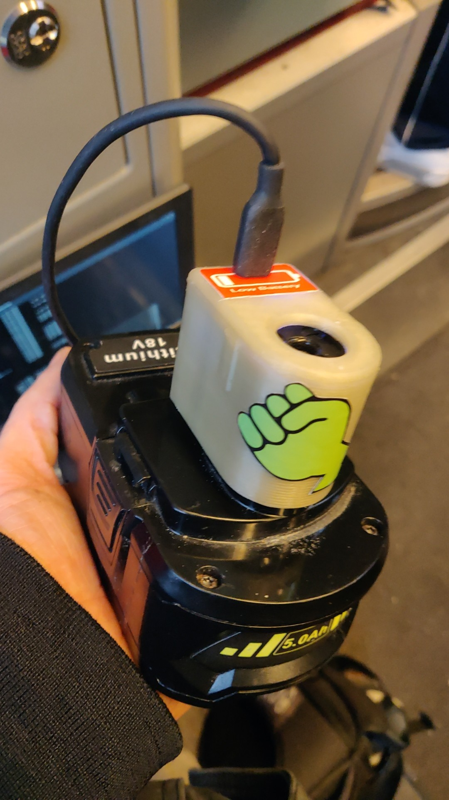

# rioby2pd
Simple 3d printable case to use a dc to power delivery module with rioby one+ batteries 

I used this module:

[https://aliexpress.com/item/1005005609777956.html](https://aliexpress.com/item/1005005609777956.html)

For the battery contacts simply bend some 1.75mm² solid copper wire. The lid glues in with superglue.. -_-'

